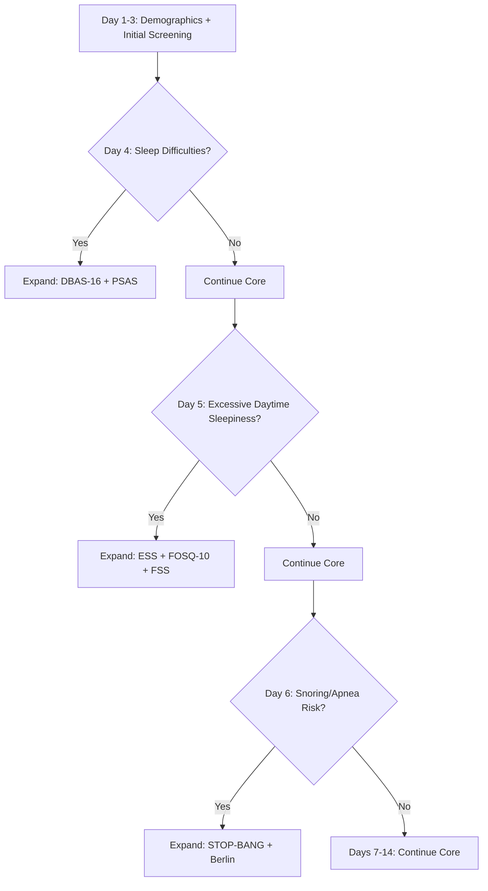

# 💤 ZOE Adaptive Onboarding System

**Version:** 1.0  
**Status:** Proof of Concept - Interactive Visualization  
**Linear Project:** [ZOE Onboarding Questionnaires](https://linear.app/sleepos/project/zoe-onboarding-questionnaires-1c7dc3bd90f7)

---

## 🎯 Overview

The ZOE Adaptive Onboarding System is an intelligent, conditionally expanding assessment engine that maps each user's unique sleep phenotype through a dynamic 14-day journey.

### Key Features

✅ **116+ Questions** across 15 sleep health pillars  
✅ **14-Day Distribution** with intelligent pacing (2-4 questions/day baseline)  
✅ **Adaptive Logic** - Trigger-based expansion modules  
✅ **Interactive Visualization** - Collapsible tree view  
✅ **Patient Journey Simulator** - Test adaptive flows  
✅ **Supabase-Ready** - Structured JSON schemas

---

## 📊 System Architecture

```
ZOE/
├── data/
│   ├── questions.json              # All 116 questions structured
│   ├── conditional_rules.json      # Trigger logic
│   ├── modules.json                # Expansion module metadata
│   ├── 14day_schedule.json         # Daily distribution
│   └── journey_simulation_*.json   # Simulated patient journeys
├── parse_questionnaire.py          # Excel → JSON parser
├── distribute_questions.py         # 14-day algorithm
├── patient_simulator.py            # Journey simulator
└── index.html                      # Interactive visualization
```

---

## 🚀 Quick Start

### 1. Parse Excel Questionnaire

```bash
python3 parse_questionnaire.py
```

**Output:**
- `data/questions.json` - 116 questions with metadata
- `data/conditional_rules.json` - 9 trigger rules
- `data/modules.json` - 17 expansion modules

### 2. Generate 14-Day Schedule

```bash
python3 distribute_questions.py
```

**Output:**
- `data/14day_schedule.json` - Daily question distribution
- Console shows pacing breakdown

**Sample Output:**
```
Day  1: 3 questions (~2min) - Welcome to ZOE
Day  2: 4 questions (~2min) - Basic Profile
Day  3: 2 questions (~2min) - Sleep Quality Check
Day  4: 1 questions (~3min) - Sleep Difficulties 🔄
        ↳ May expand: +16 questions (+8min)
...
```

### 3. Simulate Patient Journey

```bash
python3 patient_simulator.py
```

**Output:**
- Simulates 3 persona types: `healthy`, `balanced`, `problematic`
- Shows adaptive expansion in action
- Saves journey reports to `data/journey_simulation_*.json`

**Sample Simulation:**
```
🎭 Simulating Patient Journey (Persona: problematic)
Day  4 | Sleep Difficulties   |  17 questions | ~11min → Expanded: +16q (DBAS-16)
Day  5 | Daytime Energy       |  20 questions | ~12min → Expanded: +19q (FOSQ-10, FSS)

📊 Journey Summary:
   Total Questions: 46
   Total Time: 47 minutes (~0.8 hours over 14 days)
   Expansions Triggered: 2
```

### 4. View Interactive Visualization

Open `index.html` in a web browser to see:

- 📅 **14-Day Schedule** - Collapsible day cards
- 🎭 **Journey Simulator** - Simulated patient flows
- 🧩 **Expansion Modules** - Detailed module breakdown

**Features:**
- Click any day to expand/collapse
- See trigger conditions and expansion modules
- Color-coded: Blue (core) | Red (expansion triggered)
- Responsive design for mobile/desktop

---

## 📋 Data Schemas

### Question Schema

```json
{
  "id": "CORE_1",
  "number": 1,
  "text": "Full Name",
  "type": "CORE",
  "section": "DEMOGRAPHICS",
  "module": "CORE",
  "answer_type": "text",
  "options": [],
  "triggers_expansion": false
}
```

### Conditional Rule Schema

```json
{
  "trigger_question_id": "CORE_10",
  "condition": "YES",
  "expanded_modules": ["ISI", "DBAS-16", "Pre-Sleep Arousal Scale"],
  "rule_text": "→ IF YES: Expand to ISI (7 questions) + DBAS-16 (16 questions)..."
}
```

### Daily Schedule Schema

```json
{
  "day": 4,
  "title": "Sleep Difficulties",
  "description": "Understanding your sleep patterns.",
  "core_questions": [...],
  "estimated_minutes": 3,
  "can_trigger_expansion": true,
  "possible_expansions": [...]
}
```

---

## 🧬 Pillar Framework (15 Domains)

| Pillar | Description | Example Instruments |
|--------|-------------|---------------------|
| 1. Sleep Quality | Perceived restfulness | PSQI, ISI |
| 2. Sleep Quantity | Duration, sufficiency | Sleep Diary |
| 3. Sleep Regularity | Timing variability | SRI, MCTQ |
| 4. Chronotype | Circadian preference | MEQ |
| 5. Sleep Environment | Light, sound, comfort | LEQ |
| 6. Physical Health | Pain, fitness | BPI, RESTQ |
| 7. Nutrition | Diet, meal timing | MEDAS |
| 8. Mental Health | Mood, anxiety | PHQ-9, GAD-7, DASS-21 |
| 9. Cognitive Function | Focus, alertness | PROMIS CF |
| 10. Social & Lifestyle | Partner sleep, loneliness | SRM, UCLA |
| 11. Hormonal Health | Menstrual, menopause | PROMIS Menopause |
| 12. Substance Use | Alcohol, caffeine | WHO ASSIST |
| 13. Technology Use | Screen time | Media Use Scale |
| 14. Cardiometabolic | HRV, snoring | STOP-BANG |
| 15. Genetic | Sleep predispositions | Polygenic Index |

---

## 🎯 Adaptive Logic Flow



---

## 🔄 Patient Experience Design

### Baseline Experience (No Expansions)
- **30 core questions** over 14 days
- **~3 minutes per day**
- **42 minutes total** (~0.7 hours)

### Adaptive Experience (With Expansions)
- **Day with expansion trigger:**
  - User answers 1-2 core questions (2 min)
  - Trigger detected: "We need to dive deeper into this..."
  - +10-20 expansion questions (~10 min)
  - **Total that day: 12 minutes**

### User Messaging

**Normal Day:**
> "Good morning! Just 3 quick questions today about your sleep environment (2 min)"

**Expansion Triggered:**
> "Thanks for sharing. Your responses indicate we should explore this further. We have 16 additional questions that will help us understand your sleep difficulties better. This will take about 8 more minutes, but it's important for creating your personalized plan. Ready?"

---

## 📈 Statistics

- **Total Questions:** 116+
- **Core Questions:** 31 (everyone completes)
- **Expansion Modules:** 17 (conditionally triggered)
- **Daily Distribution:** 2-4 core questions/day
- **Time Commitment:**
  - Baseline: 42 minutes over 14 days
  - With expansions: 45-75 minutes (depending on triggers)

---

## 🛠️ Next Steps (Linear Issues)

- [x] **SLE-38:** Parse Excel and create structured JSON ✅
- [x] **SLE-40:** Build 14-day distribution algorithm ✅
- [x] **SLE-42:** Build patient journey simulator ✅
- [x] **SLE-41:** Create interactive visualization ✅
- [ ] **SLE-39:** Design Supabase database schema
- [ ] **SLE-43:** Create dashboard prototype

---

## 📚 Documentation

### Source Data
- **Excel File:** `Sleep_Longevity_ADAPTIVE_Complete_v4.xlsx`
- **Location:** `/Users/martinkawalski/Downloads/`

### Linear Project
- **Epic:** [SLE-37 - ZOE Adaptive Onboarding](https://linear.app/sleepos/issue/SLE-37)
- **Project:** [ZOE Onboarding Questionnaires](https://linear.app/sleepos/project/zoe-onboarding-questionnaires-1c7dc3bd90f7)

---

## 🎨 Visualization Preview

The interactive HTML visualization features:
- **Collapsible day cards** - Click to expand/collapse
- **Color coding** - Blue (core), Red (expansion)
- **Trigger indicators** - 🔄 shows adaptive days
- **Real-time stats** - Total questions, time, expansions
- **Responsive design** - Works on mobile and desktop

---

## 📝 Technical Notes

### Answer Types Detected
- `boolean` - Yes/No questions
- `scale` - 0-10 ratings
- `frequency` - Never/Rarely/Sometimes/Often/Always
- `numeric` - Hours, inches, weight
- `text` - Name, email
- `date` - Date of birth
- `single_choice` - Multiple options
- `multiple_choice` - Select all that apply

### Expansion Trigger Logic
- Parsed from Excel comments (→ IF... statements)
- Supports conditions: YES, NO, Often, Always, > threshold
- Maps to specific expansion modules
- Calculates additional question load

---

## 🚢 Deployment Readiness

### ✅ Completed
- [x] Data extraction and structuring
- [x] Adaptive logic implementation
- [x] 14-day distribution algorithm
- [x] Patient journey simulator
- [x] Interactive web visualization
- [x] JSON schemas for Supabase

### 🔜 Next Phase
- [ ] Supabase database setup
- [ ] User authentication
- [ ] Progress tracking
- [ ] Response storage
- [ ] Dashboard UI
- [ ] Mobile app integration

---

**Built with ❤️ for Sleep Longevity**  
*Factory AI + Linear Integration*
